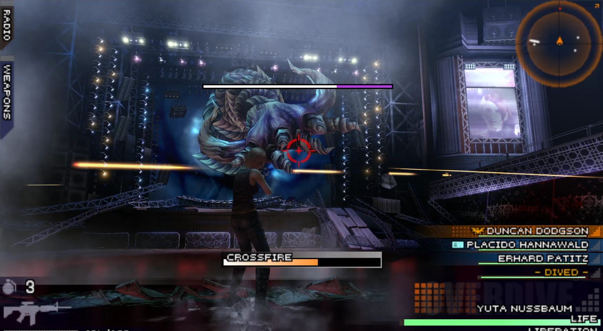
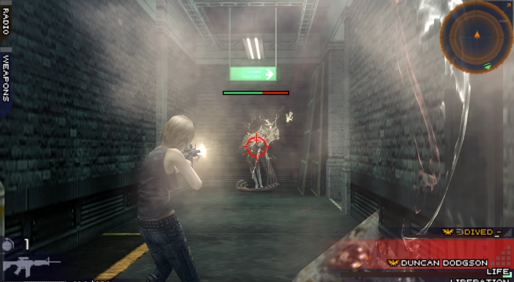
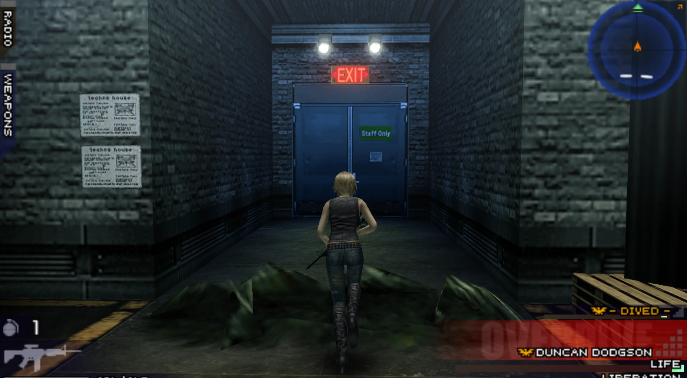

# The 3rd Birthday — native PC port (static recompilation)

A native Windows build of **The 3rd Birthday** (PSP, US release ULUS10567), made by
statically recompiling the game's MIPS code to C and running it on a native runtime
with a Vulkan renderer. It is not an emulator: the game logic runs as compiled PC code.

**Work in progress.** The game is playable from the start through the first missions,
with movies, voice, music and saving. Expect bugs.

You need your own copy of the game (a PSP disc image you dumped yourself). No game data
is included in this repository.

## Screenshots

## What works

- Boot, menus, movies (H.264 via Windows Media Foundation) with their audio
- Gameplay with ATRAC3/ATRAC3+ music and voices and the PSP sound chip (SAS)
- Saving and loading (a virtual memory stick; a "Game saved" notice after each save)
- Vulkan renderer at higher internal resolution (4x the PSP's on a 1080p screen)
- Xbox, PlayStation and other controllers through SDL3, plus keyboard
- **Twin-stick camera**: the right stick orbits the camera around Aya. Aiming follows
  the camera, and the game's own cameras take over for aiming, Overdive and Liberation.

## Controls

| Action | Controller | Keyboard |
| --- | --- | --- |
| Move | Left stick | — (a controller is needed) |
| Camera (twin-stick orbit) | Right stick | I / J / K / L |
| D-pad (the game's own camera turn) | D-pad | Arrow keys |
| Reset camera behind Aya | Right stick click (R3) | O |
| Camera speed | — | `-` / `=` |
| Cross / Circle / Square / Triangle | A / B / X / Y | X / Z / A / S |
| L / R | LB or LT / RB or RT | Q / W |
| Start / Select | Menu / View | Enter / Shift |
| Fullscreen | — | F11 or Alt+Enter |

## Settings

Plain text files next to the executable (created on first run):

- `graphics.cfg` — `render_scale` (0 = match the display, or 1 to 8)
- `twinstick.cfg` — `sensitivity`, `invert_x`, `invert_y`, `recenter`,
  `recenter_delay`, `recenter_delay_still`

## Building

The toolchain is MSYS2 UCRT64 (GCC, SDL3, Vulkan headers, glslc). See
[`runtime/README.md`](../runtime/README.md) for the recompiler and runtime, and
[`PLAN.md`](../PLAN.md) for the design decisions and a dated log of the work.
`scripts/build.sh` builds the game; `scripts/run.ps1` runs it.

## Credits and license

GPL-2.0-or-later. This project builds on other people's work — see
[`runtime/CREDITS.md`](../runtime/CREDITS.md):

- [PPSSPP](https://github.com/hrydgard/ppsspp) — the reference for PSP behaviour; several
  HLE modules (sceMpeg, SAS, ATRAC) are ported from it
- [AljandrOrtega's PSP recompilation toolkit](https://github.com/AljandrOrtega/PSP-recompilation-project) — the recompiler and runtime this port started from
- FFmpeg's ATRAC decoder (via PPSSPP's at3_standalone), SDL3

Much of the code was written with the help of an AI model (Anthropic's Claude); the
details are in [`runtime/CREDITS.md`](../runtime/CREDITS.md).

*The 3rd Birthday* is a trademark of Square Enix. This project is not affiliated with or
endorsed by Square Enix.
